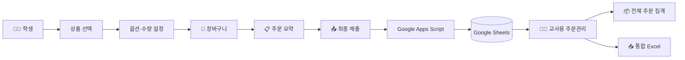
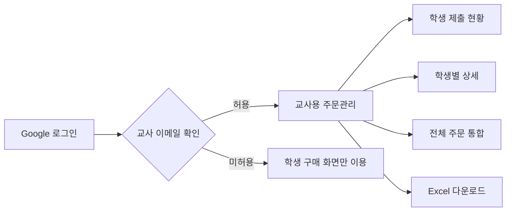
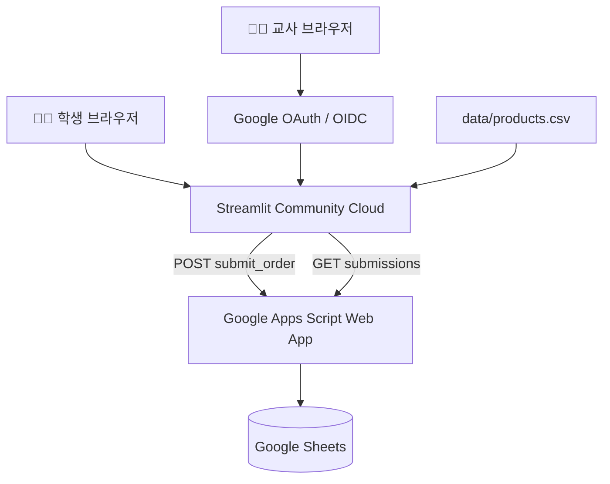
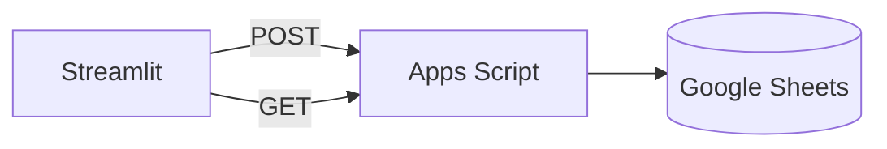

# 🤖 Eduino 구매 체크 확인

> **아두이노 프로젝트 부품 선택부터 학생 제출, 교사용 통합 주문 관리까지 한 번에 처리하는 Streamlit 기반 교육용 구매 관리 시스템**

<p align="center">
  
  
  
  
  
</p>

<p align="center">
  <a href="https://eduino-buy.streamlit.app/">🌐 Live App</a>
  ·
  <a href="https://eduino.kr/">🛒 Eduino 공식 사이트</a>
</p>

---

## 📌 프로젝트 소개

### 프로젝트 목적

**Eduino 구매 체크 확인**은 학교 아두이노 프로젝트 수업에서 학생 또는 프로젝트 팀이 필요한 부품을 선택하고, 수량과 옵션을 지정하고, 예상 구매 금액을 계산한 뒤 최종 주문 내역을 제출할 수 있도록 만든 웹 애플리케이션입니다.

학생이 제출한 데이터는 **Google Apps Script Web App**을 통해 **Google Sheets**에 저장되며, 교사는 Google 계정 인증 후 별도의 주문관리 페이지에서 학생별 제출 현황과 전체 통합 주문 내역을 확인할 수 있습니다.

### 핵심 특징

- 학생은 로그인 없이 구매 체크리스트 사용
- 상품 옵션 및 옵션별 추가금액 자동 계산
- 장바구니 기반 주문 구성
- CSV / Excel 구매 명세서 생성
- Google Sheets 최종 제출
- Google OAuth / OIDC 기반 교사 인증
- 학생별 최신 제출 자동 판별
- 상품코드 + 옵션 기준 전체 주문 통합
- 교사용 통합 Excel 다운로드

---

## 🎯 프로젝트 한눈에 보기

| 👨‍🎓 학생 | ⚙️ 시스템 | 👩‍🏫 교사 |
|---|---|---|
| 부품 선택 | Streamlit UI | Google 로그인 |
| 옵션·수량 설정 | Apps Script API | 제출 현황 확인 |
| 장바구니 관리 | Google Sheets 저장 | 학생별 상세 조회 |
| 주문 요약 | 최신 제출 판별 | 전체 주문 통합 |
| CSV / Excel 다운로드 | 상품+옵션 기준 집계 | 통합 Excel 다운로드 |
| 최종 제출 | OIDC 인증 | 허용 계정만 접근 |

---

## 🧩 해결하고자 한 문제

아두이노 프로젝트 수업에서는 학생들이 필요한 부품을 직접 정해야 하지만 실제 구매 단계에서는 다음과 같은 문제가 발생할 수 있습니다.

### 학생 측 문제

- 필요한 부품을 어떤 형식으로 제출해야 하는지 통일하기 어려움
- 수량 변경 시 금액을 다시 계산해야 함
- 상품 옵션에 따른 가격 차이를 놓치기 쉬움
- 여러 상품을 선택했을 때 전체 예상금액을 계산하기 번거로움

### 교사 측 문제

- 학생마다 제출 형식이 다르면 전체 주문을 다시 정리해야 함
- 같은 상품을 여러 학생이 주문하면 수량을 직접 합산해야 함
- 학생이 재제출했을 때 어떤 제출이 최신인지 확인하기 어려움
- 학생별 주문과 전체 주문을 별도로 정리해야 함

### 해결 방식



---

## ✨ 주요 기능

### 👨‍🎓 학생 기능

| 기능 | 설명 |
|---|---|
| 📝 **학생 기본정보** | 학년, 반, 번호, 학생명/팀원명 입력 |
| 📦 **카테고리별 상품 탐색** | 보드, 센서&모듈, 전자부품 분류 |
| ⚙️ **옵션 선택** | 색상, 기어비 등 상품별 옵션 선택 |
| 💰 **옵션별 가격 계산** | 기본가격 + 옵션 추가금액 자동 반영 |
| 🛒 **장바구니** | 동일 상품 수량 누적 및 옵션별 분리 |
| 🔢 **수량 수정** | 장바구니에서 수량 직접 변경 |
| 🗑️ **삭제 기능** | 개별 상품 삭제 및 전체 삭제 |
| 📋 **주문 요약** | 선택 품목 수, 총수량, 총 예상금액 표시 |
| 📄 **CSV 다운로드** | 학교 기안문형 품목내역 생성 |
| 📗 **Excel 다운로드** | 학생별 구매 명세서 생성 |
| 📤 **최종 제출** | Apps Script를 통해 Google Sheets 저장 |

### 👩‍🏫 교사용 기능

| 기능 | 설명 |
|---|---|
| 🔐 **Google 로그인** | Streamlit OIDC 기반 Google 인증 |
| ✅ **교사 allowlist** | 허용된 이메일만 주문관리 접근 |
| 👨‍🎓 **학생 제출 현황** | 학년, 반, 번호, 학생명, 제출일시 확인 |
| 🔎 **학생별 주문 상세** | 학생의 최신 제출 상품 전체 조회 |
| 🕒 **최신 제출 우선** | 동일 학생 재제출 시 최신 제출만 현재 주문으로 집계 |
| 📦 **전체 주문 통합** | 상품코드 + 옵션 기준 전체 수량 집계 |
| 💵 **전체 예상금액** | 전체 구매 예상금액 자동 계산 |
| 📥 **통합 Excel** | 전체주문 + 학생별제출 시트 생성 |
| 🔄 **데이터 새로고침** | Google Sheets 최신 데이터 재조회 |

---

## 🔄 사용 흐름

### 학생 사용 흐름


### 교사 사용 흐름



---

## 🖥️ 주요 화면

> `docs/images/` 폴더에 실제 화면 이미지를 추가하면 아래 영역에 바로 표시할 수 있습니다.

### 학생 구매 화면

```markdown

```

### 장바구니 및 주문 요약

```markdown

```

### 교사용 주문관리

```markdown

```

### Google Sheets 저장 결과

```markdown

```

---

## 🧱 시스템 구성

### 전체 아키텍처



### 데이터 흐름

```text
학생
↓
Streamlit
↓
Apps Script POST
↓
Google Sheets 저장


교사
↓
Google 로그인
↓
Streamlit 교사용 페이지
↓
Apps Script GET
↓
최신 제출 추출
↓
전체 주문 집계
```

---

## 🛠 기술 스택

| 영역 | 기술 |
|---|---|
| Web App | Python 3.11+, Streamlit |
| Data Processing | Pandas |
| Export | OpenPyXL, Python CSV |
| Backend API | Google Apps Script |
| Storage | Google Sheets |
| Authentication | Google OAuth 2.0 / OpenID Connect |
| Auth UI | `st.login()`, `st.user`, `st.logout()` |
| HTTP | Requests |
| Deployment | Streamlit Community Cloud |
| Version Control | GitHub |

---

## 📂 프로젝트 구조

```text
eduino-buy/
│
├── streamlit_app.py
├── requirements.txt
├── README.md
├── .gitignore
│
├── pages/
│   └── 1_교사용_주문관리.py
│
├── views/
│   ├── __init__.py
│   └── student_page.py
│
├── data/
│   └── products.csv
│
├── services/
│   ├── __init__.py
│   ├── auth_service.py
│   ├── google_sheet_service.py
│   └── excel_service.py
│
└── utils/
    ├── __init__.py
    ├── calculator.py
    └── export.py
```

---

## 📊 데이터 구조

### `products.csv`

상품 정보는 `data/products.csv`에서 관리합니다.

| 필드 | 설명 |
|---|---|
| `category` | 상위 카테고리 |
| `subcategories` | 세부 카테고리 |
| `code` | 상품 코드 |
| `name` | 상품명 |
| `price` | 기본 판매가격 |
| `url` | Eduino 상품 페이지 |
| `option_name` | 옵션 이름 |
| `options` | 선택 가능한 옵션 목록 |
| `option_prices` | 옵션별 추가금액 |

#### 예시

```csv
category,subcategories,code,name,price,url,option_name,options,option_prices
전자부품,IC/기본소자,E-14,아두이노 5파이(5mm) LED,110,https://eduino.kr/...,색상,빨강색|노랑색|파랑색|초록색|백색,
센서,모터/제어,D-75,아두이노 N20 6V 소형 기어드 DC모터,4400,https://eduino.kr/...,기어비,50RPM|100RPM|300RPM,50RPM:0|100RPM:1100|300RPM:2200
```

### 옵션 데이터 규칙

#### `options`

옵션은 `|`로 구분합니다.

```text
빨강색|노랑색|파랑색
```

#### `option_prices`

```text
옵션:추가금액|옵션:추가금액
```

예:

```text
50RPM:0|100RPM:1100|300RPM:2200
```

최종 단가:

```text
기본 판매가 + 옵션 추가금액
```

---

## 🛒 장바구니 규칙

### 동일 상품 + 동일 옵션

수량을 누적합니다.

```text
E-14 / 빨강색 × 2
+
E-14 / 빨강색 × 3
=
E-14 / 빨강색 × 5
```

### 동일 상품 + 다른 옵션

별도 주문 항목으로 처리합니다.

```text
E-14 / 빨강색 × 2
E-14 / 파랑색 × 3
```

### 지원 기능

- 수량 직접 수정
- 개별 삭제
- 전체 삭제
- 상품별 금액 자동 계산
- 총 구매 예상금액 자동 계산

---

## 📄 학생용 구매 명세서

### CSV 다운로드

학교 기안문형 품목내역으로 생성합니다.

```text
<품목내역>

학년,1학년
반,3반
번호,15번
학생명/팀원명,홍길동

순번,내용,규격,수량,단위,예상단가,예상금액
1-1,아두이노 우노 R3,A-1,1,개,2900,2900
1-2,아두이노 5파이 LED,빨강색,3,개,110,330
```

파일명 예:

```text
Eduino_품목내역_1학년_3반_15번_홍길동.csv
```

UTF-8 BOM 형식으로 생성하여 Excel 한글 호환성을 확보합니다.

### Excel 다운로드

학생별 Excel에는 다음 정보가 포함됩니다.

- 학생 기본정보
- 주문 품목
- 규격
- 수량
- 단가
- 금액
- 합계

행정문서 형태로 활용할 수 있도록 제목 병합, 헤더 강조, 정렬, 테두리, 열 너비, 줄바꿈, 천 단위 금액 포맷을 적용합니다.

---

## 🗂 Google Sheets 저장 구조

### 저장 위치

```text
Drive
└─ Streamlit
   └─ Eduino 학생제출
```

### 시트

```text
학생제출
```

### 컬럼

| 컬럼 | 설명 |
|---|---|
| 제출ID | 학생 식별용 제출 ID |
| 제출일시 | 제출 시간 |
| 학년 | 학생 학년 |
| 반 | 학생 반 |
| 번호 | 학생 번호 |
| 학생명 | 학생/팀원명 |
| 상품코드 | Eduino 코드 |
| 상품명 | 상품명 |
| 옵션 | 선택 옵션 |
| 단가 | 실제 단가 |
| 수량 | 주문 수량 |
| 금액 | 단가 × 수량 |
| 총액 | 학생 전체 주문 총액 |

> 한 번의 제출에 여러 상품이 포함되면 **동일한 제출ID와 제출일시로 여러 행**이 저장됩니다.

---

## 🕒 최신 제출 처리

### 재제출 정책

학생이 같은 정보로 여러 번 제출해도 Google Sheets의 과거 기록은 삭제하지 않습니다.

```text
1학년 1반 1번
22:55 제출 → 이전 제출

1학년 1반 1번
23:08 제출 → 최신 제출
```

### 현재 주문 판별

교사용 화면에서는 다음 조합으로 최신 제출을 선택합니다.

```text
submission_id
+
가장 최근 submitted_at
```

이때 최신 행 하나만 선택하는 것이 아니라, 같은 제출시각을 가진 **전체 상품 행을 하나의 제출 묶음으로 유지**합니다.

---

## 📦 전체 주문 통합

### 집계 기준

교사용 페이지에서는 최신 제출만 기준으로 전체 주문을 집계합니다.

```text
상품코드 + 옵션
```

예:

```text
E-14 / 빨강색
E-14 / 파랑색
```

은 서로 다른 주문 품목입니다.

### 표시 항목

- 상품코드
- 상품명
- 옵션
- 예상단가
- 총수량
- 예상금액

---

## 📥 교사용 전체 주문 Excel

### 파일 예

```text
Eduino_전체주문내역_2026-08-14.xlsx
```

### `전체주문` 시트

```text
순번
상품코드
상품명
옵션
총수량
단위
예상단가
예상금액
```

### `학생별제출` 시트

```text
학년
반
번호
학생명
제출일시
상품코드
상품명
옵션
수량
단가
금액
```

정렬 우선순위:

```text
1순위: 학년
2순위: 반
3순위: 번호
```

---

## 🔗 Google Apps Script 연동

### API 구조

Streamlit에서 Google Sheets를 직접 조작하지 않고 Apps Script Web App을 API 계층으로 사용합니다.



### 주요 함수

```text
doPost(e)
→ 학생 주문 저장

doGet(e)
→ 조회 요청 분기

getSubmissions()
→ 학생 제출 데이터 반환

getSummary()
→ 상품별 집계 반환
```

---

## 🔐 인증 및 보안

### Google 로그인

학생은 로그인 없이 앱을 사용할 수 있습니다.

교사용 주문관리만 Google 인증을 요구합니다.

```python
st.login()
st.user
st.logout()
```

### 교사 권한 판별

```text
Google 로그인
↓
사용자 이메일 확인
↓
teacher_emails allowlist 비교
↓
허용된 경우 교사용 페이지 표시
```

### Streamlit Secrets

```toml
[google_sheet]
web_app_url = "YOUR_GOOGLE_APPS_SCRIPT_WEB_APP_URL"

[auth]
redirect_uri = "https://YOUR_APP.streamlit.app/oauth2callback"
cookie_secret = "YOUR_RANDOM_COOKIE_SECRET"
client_id = "YOUR_GOOGLE_CLIENT_ID"
client_secret = "YOUR_GOOGLE_CLIENT_SECRET"
server_metadata_url = "https://accounts.google.com/.well-known/openid-configuration"

teacher_emails = [
    "YOUR_TEACHER_EMAIL"
]
```

### GitHub에 업로드하지 않는 값

- OAuth Client Secret
- `cookie_secret`
- Apps Script Web App URL
- 실제 교사 이메일 목록
- `.streamlit/secrets.toml`

---

## 🚀 설치 및 실행

### 로컬 실행

<details>
<summary><strong>설치 및 실행 방법 보기</strong></summary>

#### 1. 저장소 Clone

```bash
git clone YOUR_REPOSITORY_URL
cd eduino-buy
```

#### 2. 의존성 설치

```bash
pip install -r requirements.txt
```

#### 3. Secrets 설정

`.streamlit/secrets.toml`

```toml
[google_sheet]
web_app_url = "YOUR_GOOGLE_APPS_SCRIPT_WEB_APP_URL"

[auth]
redirect_uri = "http://localhost:8501/oauth2callback"
cookie_secret = "YOUR_RANDOM_COOKIE_SECRET"
client_id = "YOUR_GOOGLE_CLIENT_ID"
client_secret = "YOUR_GOOGLE_CLIENT_SECRET"
server_metadata_url = "https://accounts.google.com/.well-known/openid-configuration"

teacher_emails = [
    "YOUR_TEACHER_EMAIL"
]
```

#### 4. 실행

```bash
streamlit run streamlit_app.py
```

기본 주소:

```text
http://localhost:8501
```

</details>

### Streamlit Community Cloud 배포

<details>
<summary><strong>배포 설정 보기</strong></summary>

#### Main file

```text
streamlit_app.py
```

#### 배포 URL 예

```text
https://eduino-buy.streamlit.app
```

#### Google OAuth Redirect URI

```text
https://eduino-buy.streamlit.app/oauth2callback
```

Streamlit Community Cloud의 **Secrets** 메뉴에 운영용 Secret 값을 입력합니다.

#### Apps Script 수정 후

```text
Apps Script
→ 배포
→ 배포 관리
→ 기존 Web App 편집
→ 새 버전
→ 배포
```

기존 `/exec` URL을 유지하면 Streamlit Secrets를 다시 변경하지 않아도 됩니다.

</details>

---

## 🧠 주요 파일 역할

### `streamlit_app.py`

- 앱 Entry Point
- Session State 관리
- 상품 데이터 로딩
- 상품 UI
- 장바구니
- 주문 요약
- CSV / Excel 다운로드
- 최종 제출
- 인증 Sidebar
- `st.Page`
- `st.navigation`

### `views/student_page.py`

학생용 구매 페이지를 navigation에 연결합니다.

### `pages/1_교사용_주문관리.py`

- 교사 권한 검사
- 학생 제출 조회
- 최신 제출 추출
- 학년 / 반 / 학생명 필터
- 학생별 상세
- 전체 주문 통합
- 교사용 Excel

### `services/auth_service.py`

- Google 로그인 상태
- 교사 allowlist
- 교사 권한 판별
- 인증 Sidebar
- 로그아웃

### `services/google_sheet_service.py`

- `submit_order_to_sheet()`
- `fetch_submissions()`
- `fetch_order_summary()`

### `services/excel_service.py`

- 학생용 Excel
- 교사용 통합 Excel
- 행정문서형 스타일

### `utils/calculator.py`

- 계산 보조
- `format_currency()`

### `data/products.csv`

Eduino 상품 데이터

---

## 🔄 상품 데이터 캐시

상품 데이터는 `@st.cache_data`로 캐싱합니다.

CSV 파일의 수정시간(`mtime`)을 캐시 키에 포함하기 때문에 `products.csv`가 변경되면 데이터 캐시도 자동으로 갱신됩니다.

---

## ✅ 검증 완료 기능

### 학생 기능

- [x] 학생 기본정보 입력
- [x] 카테고리별 상품 표시
- [x] 상품 URL 연결
- [x] 옵션 선택
- [x] 옵션별 추가금액
- [x] 수량 선택
- [x] 상품 담기
- [x] 동일 상품 수량 누적
- [x] 옵션별 장바구니 분리
- [x] 장바구니 수량 수정
- [x] 개별 삭제
- [x] 전체 삭제
- [x] 주문 요약
- [x] CSV 다운로드
- [x] Excel 다운로드
- [x] Google Sheets 최종 제출

### Google Sheets / Apps Script

- [x] Apps Script POST 요청
- [x] 학생 제출 저장
- [x] 상품 1개당 1행 저장
- [x] 제출일시 기록
- [x] 주문 총액 저장
- [x] Apps Script GET 조회

### 교사용 기능

- [x] Google 로그인
- [x] 교사 이메일 allowlist
- [x] 교사용 메뉴 동적 표시
- [x] 직접 URL 접근 제한
- [x] 학생 제출 현황
- [x] 최신 제출 우선 처리
- [x] 학생별 주문 상세
- [x] 전체 주문 통합
- [x] 상품 + 옵션별 집계
- [x] 교사용 전체 주문 Excel 다운로드
- [x] 로그아웃

---

## 🔒 보안 원칙

### 적용 원칙

1. 학생은 로그인 없이 이용
2. 교사용 주문관리만 Google 로그인 필요
3. 교사 이메일은 allowlist 방식으로 관리
4. Secret은 Streamlit Secrets에서 관리
5. `.streamlit/secrets.toml`은 GitHub에 업로드하지 않음
6. Google Sheets 직접 접근 대신 Apps Script 사용
7. 교사 권한 검사 전에 주문 데이터 조회 금지

### 현재 구조 참고

> 현재 Apps Script Web App URL 자체에는 별도의 서버 간 인증이 추가되어 있지 않습니다.  
> 실제 민감정보를 다루는 대규모 서비스에서는 추가적인 API 인증 강화가 필요할 수 있습니다.

---

## 🎯 향후 개선 계획

### 교사용 기능

- [ ] 제출 이력 조회
- [ ] 학생별 이전 제출 비교
- [ ] 주문 마감 기능
- [ ] 제출 취소 / 수정 정책
- [ ] 학급별 제출률
- [ ] 미제출 학생 확인

### 데이터 관리

- [ ] 학년도 / 학기 구분
- [ ] 프로젝트별 주문 구분
- [ ] 교사용 상품 관리
- [ ] 상품 가격 일괄 업데이트

### 시스템

- [ ] 모바일 UI 추가 개선
- [ ] Apps Script 조회 API 인증 강화

---

## 💡 사용 팁

### 상품 추가 / 수정

`data/products.csv` 파일을 수정합니다.

### 옵션 추가

```text
옵션1|옵션2|옵션3
```

### 옵션별 추가금액

```text
옵션1:0|옵션2:1000|옵션3:2000
```

### 학생 재제출

학생이 동일한 학년 / 반 / 번호로 다시 제출해도 Google Sheets에는 이전 기록이 유지됩니다.

교사용 주문관리에서는 자동으로 **가장 최근 제출 전체**를 현재 주문으로 사용합니다.

---

## 📞 문의 및 피드백

본 애플리케이션은 학교 수업에서 아두이노 프로젝트 부품 구매 및 주문 관리를 지원하기 위해 개발되었습니다.

개선 사항이나 버그가 발견되면 프로젝트 담당자에게 문의해주세요.
